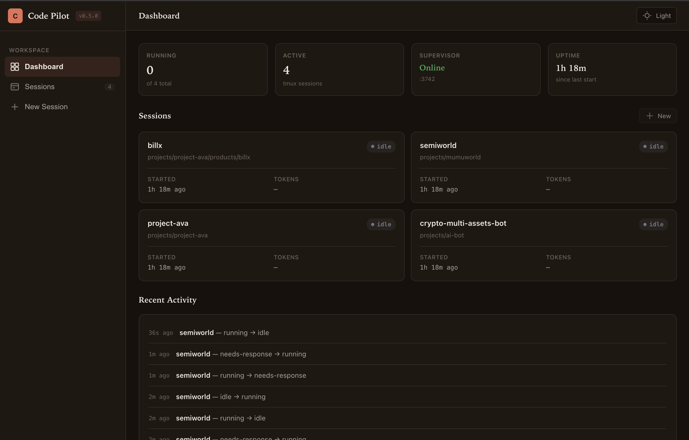

# Claude Code Remote Pilot

[](https://www.npmjs.com/package/claude-code-remote-pilot)
[](https://www.npmjs.com/package/claude-code-remote-pilot)
[](https://www.npmjs.com/package/claude-code-remote-pilot)
[](./LICENSE)

<a href="https://www.buymeacoffee.com/mekkunks"></a>

A self-hosted supervisor and remote dashboard for running multiple Claude Code sessions — monitor, control, and queue work from anywhere.

Start sessions on your machine, expose the dashboard through a secure tunnel, and manage everything from your phone while you're away.

Originally built just for personal use… then it slowly grew 😅



---

## Why?

I kept running into the same problems with long Claude Code tasks:

- sessions stopped at token limits and needed a manual nudge to continue
- running multiple sessions at once meant juggling several terminals
- I wanted to leave the machine running and check progress from my phone
- queueing up the next prompt while one task was still in progress was awkward

What started as a simple auto-resume script turned into a full remote control panel.

---

## What this is NOT

- a hosted platform
- an "AI agent framework"
- a replacement for Claude Code
- a polished enterprise product

It's a practical helper tool for people who run Claude Code for extended periods and want more control over what's happening.

---

## Features

**Session management**
- Spawn and supervise multiple Claude Code sessions, each in its own persistent tmux window
- Auto-detect token limit states and resume automatically
- Sessions outlive the pilot process — restart the pilot without losing your work
- **Terminal resize sync** — tmux pane dimensions automatically match your browser viewport so Claude's menus and borders render at the correct width

**Web dashboard**
- Full-color terminal output rendered in the browser (24-bit ANSI, bold, dim, italic)
- Terminal input behaves like a real terminal — command history (↑/↓), Tab forwarding, Ctrl+C/D/U/L, click output to focus
- **Text selection** — click-drag to copy terminal output; click without selection still focuses the input
- **Scroll lock** — auto-scroll pauses when you scroll up to read; resumes automatically when you scroll back to the bottom
- **Blinking status pill** — the "needs input" pill pulses to draw attention; a short sound alert fires on transition (toggleable in the dashboard header)
- Send messages or special keys; broadcast to all sessions at once
- **Auto-yes mode** — toggle per session to automatically confirm Claude's permission prompts
- **Menu choice detection** — when Claude shows a numbered menu (1 / 2 / 3), clickable buttons appear automatically; optional ollama fallback for non-standard output
- **Dashboard quick-reply** — send a message to any session directly from the card without opening the terminal
- **Snippet preview** — each card shows the last 4 lines of terminal output at a glance
- **Git tab** — review changes, browse diffs, and commit from the browser without leaving the dashboard
- **Open in Finder** — one-click button opens the session's working directory in macOS Finder
- Spawn, kill, or respawn sessions from the browser
- Live status updates via SSE with fallback polling
- Browser desktop notifications on status changes

**Message queue**
- Pre-queue prompts per session and play them manually or with **auto-feed** mode
- Auto-feed delivers the next queued message automatically when a session goes idle

**Remote access**
- **Cloudflared tunnel** built in — one flag exposes the dashboard publicly with password protection and sends the URL via Telegram
- Tunnel URL shown live in the TUI watch screen

**Notifications**
- Telegram alerts for limit hits, status changes, and tunnel URL on startup
- **Tap-to-open URL** in every actionable notification — LAN IP when bound to `0.0.0.0`, `127.0.0.1` otherwise; upgrades to the cloudflared tunnel URL when available
- **Telegram on/off toggle** — mute without removing credentials, from the dashboard or CLI (`telegram on|off`)
- Needs-response alerts debounced to at most once per minute per session

**Organization**
- **Session labels** — emoji prefix and color accent per session, saved to config
- **Sort** sessions by status (running first) or alphabetically

Lightweight and self-hosted — just Node.js and tmux.

---

## Current Status

Very experimental. Built quickly to scratch a personal itch, so expect rough edges. If you try it and hit weird issues, feel free to open an issue or PR.

---

## Typical Workflow

1. Start the pilot and spawn Claude Code sessions
2. Leave it running — go touch grass
3. Pilot detects limit hits and auto-resumes
4. Get notified via Telegram or browser notification
5. Check progress remotely from your phone

---

## How it works

```
npx claude-code-remote-pilot
  │
  ├── asks: mount current directory as a session?
  ├── asks: open web dashboard?
  │     └── asks: expose via cloudflared tunnel?
  ├── asks: set up Telegram? (optional)
  └── opens watch dashboard automatically
```

Watch opens immediately. Press `q` to drop to the command prompt, then `watch` to return.

```
  Claude Code Remote Pilot
  Tunnel: https://abc-xyz.trycloudflare.com  local: http://127.0.0.1:3742
  ───────────────────────────────────────────────────────────────────
  #  SESSION             STATUS          UP       USAGE / RESET
  ───────────────────────────────────────────────────────────────────
   1 🔧 api-refactor     running         12m      ↑1.2k ↓890
   2 mobile-app          limit 3m        1h 4m    resets 2:00 AM
   3 old-project         offline         —
  ───────────────────────────────────────────────────────────────────
  [1-3]: select session   w: web ui   q: exit watch
```

Press a number to select a session:
- **Active**: `[t]` open terminal · `[k]` kill · `Esc` back
- **Offline**: `[s]` re-spawn · `[r]` remove from history · `Esc` back

From any terminal, attach directly:

```bash
tmux attach -t api-refactor
# Ctrl+B then D to detach
```

---

## Install

```bash
npx claude-code-remote-pilot
```

Or install globally:

```bash
npm install -g claude-code-remote-pilot
claude-remote-pilot
```

---

## Requirements

- Node.js >= 18
- tmux
- Claude Code CLI (`npm install -g @anthropic-ai/claude-code`)

The pilot will prompt you to install missing dependencies on first run.

### Installing tmux manually

**macOS:**
```bash
brew install tmux
```

**Ubuntu / Debian:**
```bash
sudo apt update && sudo apt install tmux
```

**Fedora / RHEL:**
```bash
sudo dnf install tmux
```

**Arch:**
```bash
sudo pacman -S tmux
```

---

## Commands

| Command | Description |
|---|---|
| `spawn <path> [name]` | Start Claude at a path. Name defaults to the directory name. |
| `list` | One-shot status of all sessions. |
| `watch` | Live dashboard. Press a number to select, `q` to exit. |
| `web [port] [host] [password] [--tunnel]` | Start the web dashboard. Defaults to `127.0.0.1:3742`. Add `--tunnel` to start a cloudflared public tunnel automatically. |
| `attach <name>` | Open a tmux session in the current terminal. |
| `kill <name>` | Stop a session. |
| `telegram on\|off` | Enable or disable Telegram notifications without removing credentials. |
| `help` | Show command reference. |
| `exit` | Quit the pilot. Sessions keep running in tmux. |

---

## Web dashboard

Type `web` in the REPL to open a browser dashboard:

```
claude-pilot> web
  ✓ Web dashboard started at http://127.0.0.1:3742
```

The dashboard shows all sessions (live and offline), lets you:

- View terminal output with **full ANSI color rendering** (24-bit color, bold, dim, italic)
- Send a message to Claude directly from the browser (Esc / ↵ / ^C / ^D key buttons included)
- **Broadcast** a message to all active sessions at once
- Spawn new sessions with a name, path, and optional initial prompt
- Kill / respawn sessions
- See a live activity log of status transitions
- Receive **browser desktop notifications** when any session needs input or hits a usage limit

### Terminal keyboard shortcuts

The web terminal accepts keyboard input like a real terminal:

| Key | Action |
|---|---|
| `↑` / `↓` (empty input) | Forward arrow key to tmux — navigate Claude's numbered menus |
| `↑` / `↓` (with text) | Walk through command history (last 100 sent messages) |
| `Tab` | Forward Tab to tmux (completion, cycle options) |
| `Enter` (with text) | Send the message and clear the input |
| `Enter` (empty input) | Send a bare Enter to tmux — confirm prompts without typing |
| `Shift+Enter` | Always send a bare Enter to tmux — confirm without clearing a draft |
| `Ctrl+C` (empty input) | Send interrupt to tmux |
| `Ctrl+D` (empty input) | Send EOF to tmux |
| `Ctrl+U` | Clear the current input line |
| `Ctrl+L` | Send clear-screen to tmux |
| Click terminal output | Focus the input field (only when no text is selected) |

Key buttons in the footer (↑ ↓ ⇥ Esc ↵ ^C ^D) send directly to tmux and are useful for touch devices.

### Auto-yes

The **Auto-yes** toggle in the session header automatically presses Enter ~800 ms after Claude's status becomes `needs-response`. This confirms option 1 ("Yes") in Claude Code's permission menus without manual intervention.

Toggle it per session — it resets when you navigate away.

### Menu choice detection

When Claude shows a numbered choice menu, the options are detected from the terminal output and rendered as clickable buttons above the input:

```
 1  Yes
 2  Yes, and don't ask again this session
 3  No, tell Claude what to do differently
```

Clicking a button navigates to that option using arrow keys then Enter. The chosen button turns green with a `✓` and all buttons disable for 2.5 s — long enough to confirm it landed, short enough to retry if something went wrong.

**Regex** handles the common case instantly. If it can't parse the output, a **"Parse options…"** button appears — clicking it calls a local **ollama** model for a more robust parse.

To enable ollama fallback, set environment variables before starting the pilot:

```bash
export OLLAMA_URL=http://localhost:11434   # default
export OLLAMA_MODEL=phi3:mini             # default; any small model works
```

### Dashboard quick actions

Each active session card on the dashboard now shows:

- **Snippet** — last N meaningful terminal lines (separator and blank lines filtered out), updated every 3 s. Use the **Snippet: Off / 2 / 4 / 6 / 8** control in the dashboard header to set how many lines to show, or turn them off. Choice is saved across reloads.
- **CTA buttons** — when `needs-response` and a numbered menu is detected, the choices appear directly on the card so you can respond to multiple agents at once without opening each one
- **Quick-reply input** — type a message and press Enter or `→` to send without leaving the dashboard

### Git tab

Each session detail view has two tabs: **Terminal** and **Git**. The Git tab gives you a full-width interface for reviewing and committing changes in the session's working directory:

- **File list** (left column) — modified (`~`), untracked (`+`), and deleted (`−`) files with checkboxes. "Select all / Deselect all" at the top.
- **Diff viewer** (right column) — coloured unified diff for the selected file. Green additions, red removals. Scrollable horizontally for wide diffs.
- **Commit bar** (top) — type a message and click **↑ Commit all** or **↑ Commit (N files)** to commit selected files. Unselected files are left unstaged.

The Git tab polls for changes every 5 s and hides automatically when the working tree is clean or the directory is not a git repo.

The three API routes it uses:

```
GET  /api/sessions/:name/git/status       — git status --porcelain
GET  /api/sessions/:name/git/diff?file=   — staged, unstaged, and untracked diffs
POST /api/sessions/:name/git/commit       — git add + git commit
```

### Open in Finder

The session detail header includes a **📂 Finder** button (macOS only). It calls `POST /api/sessions/:name/open-finder` and opens the session's working directory in Finder. The button shows `✓` briefly on success.

### Telegram toggle

The dashboard header shows a **Telegram: On / Off** toggle when a bot token is configured. Use it to mute notifications without removing your credentials — handy when you're actively watching the dashboard and don't want your phone buzzing. From the CLI: `telegram on` / `telegram off`.

Needs-response notifications are debounced — at most one per session per minute, so a session that briefly flickers between states won't spam you.

### Session labels

In the session detail sidebar, assign a label to any session:

- **Emoji** — shown as a prefix on the session card and in the detail title (e.g. `🔧 api-refactor`)
- **Color** — 9-color palette; renders as a colored left border on cards and the sessions table

Labels are saved permanently to `~/.claude-remote-pilot.json`.

### Sort order

Use the **Status / Name** toggle in the dashboard header to sort sessions:

- **Status** (default): running → needs response → idle → limit → offline
- **Name**: alphabetical

Choice is saved across page reloads.

### Message queue

Each session has a message queue accessible in the session detail view:

- **Enqueue** prompts to be delivered later
- **▶ Play** button on the first item sends it immediately (manual mode)
- **Auto-feed** toggle: automatically sends the next queued message each time the session transitions to idle or needs-response — useful for chaining a series of tasks without babysitting

```
Queue  [3]                                      [⚡ Auto-feed on]
┌─────────────────────────────────────────────────────────────┐
│ ▶  next → Review the implementation for edge cases      ✕  │
│ 2  Write unit tests for the new functions               ✕  │
│ 3  Commit with a descriptive message                    ✕  │
└─────────────────────────────────────────────────────────────┘
[ Type a message to queue…                      ] [+ Enqueue]
```

---

## Cloudflared tunnel

The simplest way to access the dashboard remotely. During startup the pilot asks:

```
Open web dashboard? (Y/n) y
Expose publicly via cloudflared tunnel? (y/N) y

  ⚠  Public tunnel exposes your dashboard to the internet.
  Set a password (strongly recommended, Enter to skip): ••••••••
  Password protection enabled.

  ✓ Web dashboard at http://127.0.0.1:3742
  Starting cloudflared tunnel...
  ✓ Tunnel ready: https://abc-xyz.trycloudflare.com
    Note: first visit may show a Cloudflare warning — click "Proceed" to open the dashboard.
  ✓ Tunnel URL sent via Telegram.
```

The tunnel URL is also shown live in the watch mode TUI and sent via Telegram (if configured).

Or start a tunnel from the REPL at any time:

```
claude-pilot> web 3742 127.0.0.1 mypassword --tunnel
  ✓ Web dashboard started at http://127.0.0.1:3742
  Password protection enabled.
  Starting cloudflared tunnel...
  ✓ Tunnel ready: https://abc-xyz.trycloudflare.com
```

### Install cloudflared

**macOS:**
```bash
brew install cloudflare/cloudflare/cloudflared
```

**Linux:**
```bash
curl -L https://github.com/cloudflare/cloudflared/releases/latest/download/cloudflared-linux-amd64 \
  -o /usr/local/bin/cloudflared && chmod +x /usr/local/bin/cloudflared
```

### Persistent tunnel with a custom domain

For a stable URL, use a named tunnel with your own domain on Cloudflare:

**1. Authenticate and create a tunnel:**
```bash
cloudflared tunnel login
cloudflared tunnel create claude-pilot
```

**2. Create `~/.cloudflared/config.yml`:**
```yaml
tunnel: <your-tunnel-id>
credentials-file: /home/<user>/.cloudflared/<tunnel-id>.json

ingress:
  - hostname: pilot.yourdomain.com
    service: http://127.0.0.1:3742
  - service: http_status:404
```

**3. Add DNS and run:**
```bash
cloudflared tunnel route dns claude-pilot pilot.yourdomain.com
cloudflared tunnel run claude-pilot
```

Add **Cloudflare Access** in front for zero-trust authentication (no inbound ports, no VPN).

---

## Telegram setup

Create a bot via `@BotFather` and get your token.

Get your chat ID:

```bash
curl "https://api.telegram.org/bot<TOKEN>/getUpdates"
```

Run the pilot — it will ask for these values interactively, or set them as environment variables:

```bash
export TELEGRAM_BOT_TOKEN="your-token"
export TELEGRAM_CHAT_ID="your-chat-id"
npx claude-code-remote-pilot
```

Telegram notifications are sent for:
- Session status changes (limit hit, needs response)
- Cloudflared tunnel URL when it comes online

---

## Environment variables

| Variable | Default | Description |
|---|---|---|
| `TELEGRAM_BOT_TOKEN` | — | Telegram bot token |
| `TELEGRAM_CHAT_ID` | — | Telegram chat ID |
| `CLAUDE_COMMAND` | `claude` | Command used to start Claude |
| `OLLAMA_URL` | `http://localhost:11434` | Ollama endpoint for menu option parsing fallback |
| `OLLAMA_MODEL` | `phi3:mini` | Model used for menu parsing (any small model works) |

---

## Recommended Claude workflow

For long-running tasks, ask Claude to keep external state:

```
Maintain TASK_STATE.md.
After every meaningful step update: what's done, current status, next exact action.
If interrupted, read TASK_STATE.md and resume from where you left off.
```

Context can drift over long sessions. External state is the real resume brain.

---

## Safety

Start Claude without `--dangerously-skip-permissions` unless you know what you're doing. The pilot is designed for human-supervised workflows:

- watches output
- sends notifications
- sends `continue` after limit resets
- **Auto-yes** is opt-in per session and off by default — enable it deliberately when you trust the task

When using the tunnel feature, always set a password. Anyone with the URL can control your sessions.

---

## Roadmap

- [x] tmux session management
- [x] usage limit detection and auto-resume
- [x] Telegram notifications
- [x] interactive REPL — spawn, watch, attach, kill
- [x] multi-session support
- [x] web dashboard — React SPA, SSE live updates, ANSI color rendering
- [x] persistent session history with offline session display
- [x] browser desktop notifications on status changes
- [x] broadcast message to all sessions
- [x] auto-discover untracked tmux sessions on startup
- [x] cloudflared tunnel auto-setup with password protection
- [x] message queue per session with auto-feed mode
- [x] session labels — emoji + color accent
- [x] sort sessions by status or name
- [x] terminal keyboard UX — command history, arrow/Tab/Ctrl key forwarding, click-to-focus
- [x] auto-yes mode — per-session toggle to confirm Claude permission prompts automatically
- [x] menu choice detection — numbered menus become CTA buttons; ollama fallback for tricky output
- [x] dashboard quick-reply and snippet preview per session card (Off/2/4/6/8 line toggle)
- [x] Telegram on/off toggle — dashboard + CLI, with needs-response debounce
- [x] terminal resize sync — tmux pane tracks browser viewport via ResizeObserver
- [x] Telegram notifications include tap-to-open dashboard URL (LAN → tunnel upgrade)
- [x] mobile UX — section controls stack vertically, 44px CTA touch targets, scrollable footer keys
- [x] mobile card width fix — `min-width:0` on grid items + `overflow-x:hidden` on content area
- [x] status pill always visible — `flex-shrink:0` on pill, `flex:1;min-width:0` on name container
- [x] terminal text copy — click-drag selects; focus only stolen when selection is empty
- [x] Enter on empty sends bare Enter to tmux; Shift+Enter always sends Enter regardless of input
- [x] git tab — full-width diff viewer and commit UI in the session detail view
- [x] open in Finder — one-click button from session detail header (macOS)
- [ ] smarter retry logic
- [ ] usage statistics and session timeline
- [ ] pluggable notification providers

---

## Contributing

PRs, ideas, and weird experiments are welcome 😄

---

## License

MIT
